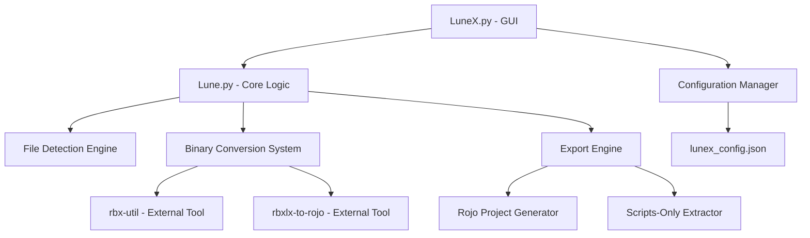

# LuneX Architecture & Development Documentation

## 📖 Overview

This comprehensive documentation covers all aspects of LuneX to enable efficient AI-assisted development, future enhancements, and cross-platform solutions. It serves as a complete reference for understanding the codebase architecture, design patterns, and implementation strategies.

## 🏗️ Project Architecture

### High-Level Architecture

```
LuneX Project Structure:
├── GUI Layer (LuneX.py)          - Tkinter-based user interface
├── Core Logic (Lune.py)          - File processing and export engine
├── External Tools Integration    - Rojo ecosystem tools
├── Configuration Management      - JSON-based settings persistence
├── Cross-Platform Support        - OS-specific adaptations
└── Testing Framework            - Automated validation suite
```

### Component Relationships



## 🖥️ GUI Architecture (LuneX.py)

### Design Philosophy
- **Simplicity First**: Clean, intuitive interface requiring minimal user input
- **Memory-Driven**: Remembers user preferences and frequently used paths
- **Cross-Platform Native**: Adapts to platform-specific UI conventions
- **Error-Resistant**: Comprehensive validation and user feedback

### Component Structure

#### 1. Configuration Management System
```python
# Location: Lines 10-38
# Purpose: Persistent user preferences and directory memory

def load_config():
    """
    Loads user configuration from lunex_config.json
    - Handles missing files gracefully with sensible defaults
    - Merges with default config to handle version upgrades
    - Error handling for corrupted JSON files
    """

def save_config(config):
    """
    Persists configuration changes immediately
    - Atomic write operations to prevent corruption
    - Exception handling for permission issues
    """
```

**AI Development Notes:**
- Configuration is JSON-based for easy modification by AI tools
- Default values ensure graceful degradation
- Platform-agnostic path handling using `os.path.expanduser()`

#### 2. Core Export Logic Bridge
```python
# Location: Lines 40-63
# Purpose: Interface between GUI and core processing engine

def run_lune_export(input_file, output_dir, export_mode, create_project_json=False):
    """
    Subprocess execution of Lune.py with parameter validation
    - Command building with dynamic argument construction
    - Error capture and user-friendly message formatting
    - Timeout protection for large file processing
    """
```

**AI Development Notes:**
- Uses subprocess for clean separation of concerns
- Captures both stdout and stderr for comprehensive error reporting
- Command array construction prevents injection attacks

#### 3. Main GUI Class Architecture
```python
# Location: Lines 66-254
# Class: LuneX_GUI(tk.Tk)
# Purpose: Primary application interface
```

##### GUI Component Hierarchy:
```
LuneX_GUI (Main Window)
├── Title Section
├── File Selection Frame
│   ├── Path Display Entry (readonly)
│   └── Browse Button
├── Export Mode Selection Frame
│   ├── Rojo Mode Radio Button + Description
│   ├── Scripts-Only Mode Radio Button + Description
│   └── Project JSON Checkbox (conditional)
├── Directory Settings Frame
│   ├── Default Source Setting
│   └── Default Destination Setting
├── Export Action Frame
│   └── Export Button (styled)
└── Status Display
```

##### Key Design Patterns:

**1. State Management**
```python
# GUI state variables tied to configuration
self.file_path_var = tk.StringVar()
self.export_mode_var = tk.StringVar(value=self.config.get("last_export_mode", "rojo"))
self.create_project_json_var = tk.BooleanVar(value=False)
```

**2. Platform-Specific Styling**
```python
# Adaptive theming based on OS
if platform.system() == "Darwin":
    self.style.theme_use('aqua')  # macOS native look
else:
    self.style.theme_use('clam')  # Cross-platform fallback
```

**3. Cross-Platform File Operations**
```python
# Platform-specific directory opening
if platform.system() == "Windows":
    os.startfile(output_dir)
elif platform.system() == "Darwin":  # macOS
    subprocess.Popen(["open", output_dir])
else:  # Linux
    subprocess.Popen(["xdg-open", output_dir])
```

### GUI Enhancement Opportunities for AI Development

1. **Drag & Drop Support**: Add file drop capability to file selection area
2. **Progress Indicators**: Real-time progress bars for large file conversions
3. **Recent Files Menu**: Quick access to recently processed files
4. **Theme Selection**: Light/dark mode toggle with persistence
5. **Batch Processing**: Multiple file selection and queue management
6. **Preview Pane**: Tree view of detected game structure before export

## 🔧 Core Logic Architecture (Lune.py)

### Processing Pipeline Overview

```
Input (.rbxl/.rbxlx) → Detection → Conversion → Parsing → Export → Output
```

### 1. File Detection Engine

#### Binary Format Detection System
```python
# Location: Lines 12-47
# Function: convert_rbxl_to_xml()
# Purpose: Intelligent format detection and conversion coordination
```

**Detection Algorithm:**
1. **Header Analysis**: Read first 200 bytes of file
2. **XML Markers**: Check for `<?xml` signature
3. **Binary Signatures**: Look for `<roblox!` or `RBLX` markers
4. **UTF-8 Fallback**: Attempt text parsing for edge cases
5. **Format Classification**: Route to appropriate processing pipeline

**AI Development Insights:**
- Uses multiple detection methods for robustness
- Handles various encoding scenarios
- Graceful degradation with informative error messages
- Extensible for new format support

#### Conversion Coordination System
```python
# Location: Lines 49-61
# Purpose: Manages multiple conversion strategies with fallback chain
```

**Conversion Strategy Pattern:**
1. **Primary**: Local rbx-util from project dependencies
2. **Secondary**: System-installed external tools
3. **Tertiary**: Python-based conversion libraries
4. **Fallback**: User guidance and manual process instructions

### 2. External Tool Integration System

#### Tool Discovery and Execution
```python
# Location: Lines 63-150
# Function: _try_external_converters()
# Purpose: Dynamic tool discovery and execution management
```

**Tool Integration Architecture:**
- **Local Tools**: Project-bundled binaries in `external-tools/`
- **System Tools**: PATH-based tool discovery
- **Fallback Chain**: Multiple tool attempts with priority ordering
- **Error Handling**: Comprehensive error capture and user guidance

**Tool Configuration:**
```python
# Primary tool (rbx-util)
rbx_util_path = os.path.join(os.path.dirname(__file__), 
                           "external-tools", "rojo-ecosystem", 
                           "rbx-dom", "target", "release", "rbx-util")

# System tool discovery
converters = [
    ('rbx-util', ['convert', rbxl_path]),
    ('rbxlx-to-rojo', [rbxl_path]),
    ('rojo', ['rbxl-to-rbxlx', rbxl_path]),
]
```

#### Cross-Platform Executable Handling
- **Windows**: `.exe` extension handling
- **Unix Systems**: Direct binary execution
- **Permission Management**: Executable bit verification
- **Path Resolution**: Absolute path construction for reliability

### 3. Export Engine Architecture

#### Multi-Mode Export System
```python
# Location: Lines 400-656 (estimated)
# Purpose: Flexible export pipeline supporting multiple output formats
```

**Export Modes:**

1. **Rojo Mode** (`--mode rojo`)
   - Complete project structure generation
   - `default.project.json` creation with hierarchy mapping
   - Source code organization in `src/` directory
   - Preserves original folder structure and properties

2. **Scripts-Only Mode** (`--mode scripts-only`)
   - Flat directory structure with all scripts
   - Metadata files (`.meta.json`) for original location tracking
   - Optional project.json generation for Rojo compatibility
   - Simplified structure for analysis and quick extraction

#### Project.json Generation Logic
```python
# Template-based generation with dynamic content insertion
# Supports multiple project templates:
# - game-template.project.json (full game structure)
# - library-template.project.json (library/module focus)
# - simple-template.project.json (minimal structure)
```

### Core Logic Enhancement Opportunities

1. **Streaming Processing**: Handle large files without loading entirely into memory
2. **Parallel Processing**: Multi-threaded conversion for batch operations
3. **Plugin Architecture**: Extensible converter plugin system
4. **Validation Engine**: Pre/post-processing validation with detailed reporting
5. **Asset Management**: Integration with tarmac for game asset handling
6. **Incremental Updates**: Smart diff-based updates for existing projects

## 🔄 Configuration Management System

### Configuration Schema
```json
{
  "last_source_dir": "/path/to/last/source/directory",
  "last_dest_dir": "/path/to/last/destination/directory", 
  "default_source_dir": "/path/to/default/source",
  "default_dest_dir": "/path/to/default/destination",
  "last_export_mode": "rojo|scripts-only",
  "gui_preferences": {
    "window_geometry": "600x500+100+100",
    "theme": "system|light|dark",
    "recent_files": ["file1.rbxl", "file2.rbxl"]
  }
}
```

### Configuration Management Patterns

#### Atomic Updates
- Load → Modify → Save pattern prevents partial updates
- Exception handling ensures configuration integrity
- Default value merging handles schema evolution

#### Cross-Platform Path Handling
```python
# Platform-agnostic home directory resolution
default_config = {
    "last_source_dir": os.path.expanduser("~"),
    "last_dest_dir": os.path.expanduser("~"),
}

# Consistent path separator handling
path = os.path.normpath(user_path)
```

## 🌐 Cross-Platform Compatibility

### Platform Detection Strategy
```python
import platform

system = platform.system()
# Returns: 'Windows', 'Darwin' (macOS), 'Linux'

# Platform-specific adaptations:
if system == "Darwin":
    # macOS-specific code
elif system == "Windows": 
    # Windows-specific code
else:
    # Unix/Linux fallback
```

### Cross-Platform Considerations

#### 1. File System Operations
- **Path Separators**: Use `os.path.join()` for all path construction
- **File Permissions**: Handle executable bits on Unix systems
- **Case Sensitivity**: Consistent file naming across platforms
- **Reserved Names**: Avoid Windows reserved filenames (CON, PRN, etc.)

#### 2. GUI Adaptations
- **Native Theming**: Platform-appropriate widget styling
- **Font Handling**: System font detection and fallback
- **Keyboard Shortcuts**: Platform-specific key combinations
- **File Dialogs**: Native file browser integration

#### 3. Subprocess Management
- **Shell Differences**: Command execution across different shells
- **Environment Variables**: PATH and execution environment handling
- **Process Termination**: Graceful shutdown across platforms
- **Output Encoding**: Consistent text encoding handling

#### 4. External Tool Integration
- **Binary Extensions**: `.exe` handling on Windows
- **Search Paths**: Tool discovery in platform-specific locations
- **Dependency Management**: Library and runtime requirements

## 🧪 Testing Framework Architecture

### Test Structure
```
test_lunex.py
├── Environment Verification
├── Core Functionality Tests
├── Binary Conversion Tests
├── External Tool Validation
└── Integration Tests
```

### Testing Strategies

#### 1. Component Testing
```python
# Test individual functions with known inputs
def test_binary_detection():
    # Test with known binary file
    # Test with known XML file
    # Test with edge cases
```

#### 2. Integration Testing
```python
# Test complete workflows
def test_end_to_end_conversion():
    # Binary .rbxl → XML → Rojo Project
    # Validate each step of the pipeline
```

#### 3. Cross-Platform Testing
```python
# Platform-specific behavior validation
def test_cross_platform_operations():
    # File operations on different filesystems
    # Path handling across platforms
    # GUI behavior on different window managers
```

### Testing Enhancement Opportunities

1. **Automated GUI Testing**: Selenium-like GUI automation
2. **Performance Benchmarking**: Large file processing metrics
3. **Memory Usage Profiling**: Memory leak detection
4. **Error Scenario Testing**: Comprehensive edge case coverage
5. **Regression Testing**: Automated detection of breaking changes

## 📁 File Organization Patterns

### Project Structure Philosophy
```
LuneProjects/
├── Core Application Files
│   ├── Lune.py              # Core processing engine
│   ├── LuneX.py             # GUI application
│   └── test_lunex.py        # Testing suite
├── Documentation
│   ├── README.md            # Primary documentation
│   ├── docs/                # Detailed documentation
│   └── *.md                 # Specialized documentation
├── External Dependencies
│   └── external-tools/      # Bundled external tools
├── User Data
│   ├── samples/             # Test files and examples
│   ├── templates/           # Project templates
│   └── exports/             # Default export location
├── Output
│   ├── test_output/         # Testing output directory
│   └── [user-generated]/    # User export directories
└── Configuration
    └── lunex_config.json    # Persistent user settings
```

### Directory Management Patterns

#### Auto-Creation Strategy
- **Lazy Creation**: Directories created on first use
- **Permission Handling**: Graceful degradation for permission issues
- **Cleanup Policies**: Temporary file management
- **Backup Strategies**: Configuration backup and recovery

## 🔌 Extension and Plugin Architecture

### Current Extension Points

#### 1. Converter Plugins
```python
# Extensible converter registration system
def register_converter(name, converter_class):
    """Register new conversion tool"""
    
class ConverterInterface:
    def can_convert(self, file_path): pass
    def convert(self, input_path, output_path): pass
    def get_priority(self): pass
```

#### 2. Export Mode Plugins
```python
# New export modes can be added
def register_export_mode(mode_name, exporter_class):
    """Register new export mode"""
    
class ExportModeInterface:
    def export(self, parsed_data, output_dir): pass
    def get_description(self): pass
    def get_options(self): pass
```

#### 3. Template System Extensions
```python
# Template discovery and registration
def discover_templates(template_dir):
    """Auto-discover available templates"""
    
def register_template(name, template_path):
    """Register custom template"""
```

### Future Extension Opportunities

1. **Asset Pipeline Integration**: Image, audio, and 3D model processing
2. **Code Analysis Tools**: Script complexity metrics and optimization suggestions
3. **Version Control Integration**: Git hooks and automated commits
4. **Cloud Storage Connectors**: Direct upload to GitHub, GitLab, etc.
5. **Collaboration Features**: Shared project settings and team workflows

## 🚀 AI-Assisted Development Guidelines

### Code Patterns for AI Enhancement

#### 1. Consistent Error Handling
```python
# Standard error handling pattern
try:
    result = risky_operation()
    if not result:
        return False, "Operation failed: specific reason"
    return True, "Success message"
except SpecificException as e:
    return False, f"Specific error: {e}"
except Exception as e:
    return False, f"Unexpected error: {e}"
```

#### 2. Modular Function Design
```python
# Functions are single-purpose and testable
def process_file(input_path, options=None):
    """
    Process a single file with optional configuration
    
    Args:
        input_path (str): Path to input file
        options (dict, optional): Processing options
        
    Returns:
        tuple: (success: bool, result_or_error: str)
    """
```

#### 3. Configuration-Driven Behavior
```python
# Behavior controlled by configuration
def get_default_options():
    return {
        "timeout": 60,
        "max_retries": 3,
        "fallback_enabled": True,
        "verbose_output": False
    }
```

### AI Development Recommendations

#### 1. Code Generation Targets
- **New Converter Implementations**: Follow existing converter patterns
- **GUI Enhancement**: Use established tkinter patterns
- **Test Case Generation**: Mirror existing test structure
- **Documentation Updates**: Maintain consistent documentation style

#### 2. Refactoring Opportunities
- **Extract Configuration Classes**: Centralized configuration management
- **Implement Observer Pattern**: Event-driven status updates
- **Add Dependency Injection**: Testable component isolation
- **Create Service Layer**: Business logic separation

#### 3. Feature Development Priorities
1. **User Experience**: Focus on reducing friction and improving workflows
2. **Error Resilience**: Comprehensive error handling and recovery
3. **Performance**: Optimize for large file processing
4. **Extensibility**: Maintain plugin architecture compatibility

## 🔍 Debugging and Development Tools

### Built-in Debugging Features

#### 1. Verbose Output Modes
```python
# Comprehensive logging throughout processing pipeline
print("🔍 Detected binary .rbxl file format")
print("🔄 Converting...")
print("✅ Successfully converted")
print("❌ Conversion failed")
```

#### 2. Test Suite Integration
```python
# Run comprehensive validation
python3 test_lunex.py

# Expected output provides clear pass/fail indicators
✓ Lune.py found
✓ Binary conversion working
✗ Missing dependency detected
```

#### 3. Configuration Inspection
```python
# Configuration is human-readable JSON
cat lunex_config.json

# Shows current settings and paths
{
  "last_source_dir": "/Users/user/Documents/Roblox",
  "last_export_mode": "rojo"
}
```

### Development Environment Setup

#### 1. Required Dependencies
```bash
# Python 3.7+ with tkinter support
python3 --version
python3 -c "import tkinter"

# Rust toolchain for external tools
rustc --version
cargo --version
```

#### 2. External Tool Building
```bash
# Build rbx-dom tools
cd external-tools/rojo-ecosystem/rbx-dom/
cargo build --release

# Build rbxlx-to-rojo
cd ../rbxlx-to-rojo/
cargo build --release
```

#### 3. Testing Workflow
```bash
# Run test suite
python3 test_lunex.py

# Test specific functionality
python3 Lune.py samples/test.rbxl output/ --mode rojo

# GUI testing
python3 LuneX.py
```

## 📊 Performance Considerations

### Current Performance Characteristics

#### 1. Memory Usage
- **XML Parsing**: DOM-based parsing loads entire file into memory
- **File Processing**: Sequential processing of game objects
- **Output Generation**: Template-based generation with string manipulation

#### 2. Processing Time Factors
- **File Size**: Linear relationship with file size
- **Conversion Step**: Additional time for binary files
- **Output Mode**: Rojo mode requires more processing than scripts-only

#### 3. I/O Optimization
- **Sequential File Access**: Single-pass processing where possible
- **Temporary File Management**: Cleanup of intermediate files
- **Cross-Platform File Operations**: Optimized for different filesystems

### Performance Enhancement Opportunities

#### 1. Streaming Processing
```python
# Replace DOM parsing with streaming XML parser
import xml.sax

class RobloxHandler(xml.sax.ContentHandler):
    def startElement(self, name, attrs):
        # Process elements as they're encountered
        pass
```

#### 2. Parallel Processing
```python
# Multi-threaded processing for independent operations
import concurrent.futures

with concurrent.futures.ThreadPoolExecutor() as executor:
    futures = [executor.submit(process_item, item) for item in items]
    results = [future.result() for future in futures]
```

#### 3. Caching Strategies
```python
# Cache conversion results and parsed data
import functools

@functools.lru_cache(maxsize=128)
def parse_template(template_path):
    # Expensive template parsing cached
    pass
```

## 🎯 Future Development Roadmap

### Phase 1: Core Enhancements
- **Streaming XML Processing**: Memory-efficient large file handling
- **Progress Indicators**: Real-time progress feedback
- **Batch Processing**: Multiple file processing queues
- **Enhanced Error Recovery**: Automatic retry mechanisms

### Phase 2: User Experience
- **Drag & Drop Interface**: Intuitive file selection
- **Recent Files Menu**: Quick access to previous projects
- **Project Workspace**: Persistent project settings
- **Theme Customization**: User interface personalization

### Phase 3: Developer Experience
- **Plugin API**: Third-party extension support
- **CLI Enhancements**: Advanced command-line features
- **Integration Tools**: IDE and editor integrations
- **Documentation Generator**: Automated documentation updates

### Phase 4: Enterprise Features
- **Team Collaboration**: Shared project configurations
- **Version Control**: Git integration and automation
- **Cloud Integration**: Remote storage and sharing
- **Enterprise Security**: Audit trails and access controls

---

## 📚 Additional Resources

### External Documentation
- [Rojo Documentation](https://rojo.space/docs/) - Official Rojo project documentation
- [rbx-dom Documentation](https://github.com/rojo-rbx/rbx-dom) - Binary format specifications
- [Roblox Developer Hub](https://developer.roblox.com/) - Official Roblox development resources

### Development References
- [Python tkinter Documentation](https://docs.python.org/3/library/tkinter.html) - GUI framework reference
- [Cross-Platform Python](https://docs.python.org/3/library/platform.html) - Platform detection and adaptation
- [Subprocess Management](https://docs.python.org/3/library/subprocess.html) - External tool integration

This documentation provides a comprehensive foundation for AI-assisted development, enabling efficient enhancement and maintenance of the LuneX project across all platforms and use cases.
