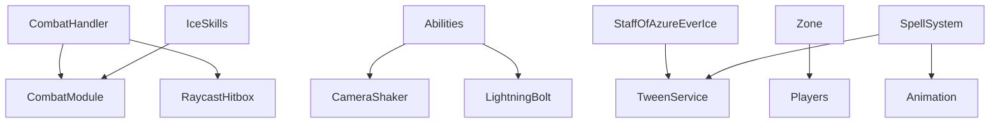

# 📚 LuneX Library Index
*Auto-generated from project analysis*

## 🎯 OVERVIEW

This index catalogs all the systems, modules, and frameworks discovered in the current LuneX project exports. These will be organized into the new library system for easy reuse and integration.

---

## 🗂️ SYSTEM CATEGORIES

### ⚔️ COMBAT SYSTEMS
**Location**: `library/combat-systems/`

#### **CombatModule** 
- **Files Found**: `ReplicatedStorage/Modules/Shared/CombatModule/ModuleScript.lua`
- **Description**: Core combat mechanics with knockback, ragdoll, and damage systems
- **Features**:
  - Strong/Up knockback systems
  - Ragdoll mechanics with CollectionService tags
  - Disabled state management
  - Body physics manipulation
- **Dependencies**: CollectionService
- **Status**: ✅ Ready for extraction

#### **CombatHandler**
- **Files Found**: `ReplicatedStorage/Modules/Shared/CombatHandler/ModuleScript.lua`
- **Description**: Advanced weapon combat system with combos and hitboxes
- **Features**:
  - Multiple weapon types (Yoru, Basic Sword, Black Leg, Standard)
  - 4-hit combo system with timing
  - Animation integration
  - Hitbox management with RaycastHitbox
  - Cooldown and delay systems
- **Dependencies**: RaycastHitbox, RemoteEvents
- **Status**: ✅ Ready for extraction

#### **Abilities System**
- **Files Found**: Multiple ability templates in `ReplicatedStorage/Modules/Templates/Abilities/`
- **Systems**: BladeHit, GateHit, GateSword, Lightning, Xinyan
- **Description**: Modular ability effect system
- **Features**:
  - Visual effects integration
  - Camera shake effects
  - Particle system management
  - Lightning bolt effects
- **Dependencies**: TweenService, CameraShaker, LightningBolt
- **Status**: ✅ Ready for extraction

### 🌟 MAGIC SYSTEMS
**Location**: `library/magic-systems/`

#### **StaffOfAzureEverIce**
- **Files Found**: `StarterPack/StaffOfAzureEverIce/`
- **Description**: Complex spell casting system with visual effects
- **Features**:
  - Multi-circle spell casting
  - Client-server synchronization
  - Advanced visual effects
  - Particle systems and lighting
  - Debris and floating effects
- **Dependencies**: TweenService, Debris, RemoteEvents
- **Status**: ✅ Ready for extraction

#### **IceSkills**
- **Files Found**: `ServerStorage/Skills/IceSkills/ModuleScript.lua`
- **Description**: Elemental ice magic framework
- **Features**:
  - Z/X skill system
  - Damage scaling with magic stats
  - Cooldown management
  - Coordinate-based spell positioning
- **Dependencies**: RemoteEvents, CombatModule
- **Status**: ✅ Ready for extraction

#### **Spellbook System**
- **Files Found**: Multiple spell scripts in `StarterPlayer/StarterCharacterScripts/`
- **Description**: Multi-spell casting framework
- **Features**:
  - 7+ different spell types
  - Fireball, poison cloud, earth effects
  - Player movement control during casting
  - Visual feedback systems
- **Dependencies**: TweenService, Animation system
- **Status**: ✅ Ready for extraction

### 🎮 CHARACTER SYSTEMS
**Location**: `library/character-systems/`

#### **Character Controller**
- **Files Found**: Multiple character control scripts
- **Description**: Advanced character movement and state management
- **Features**:
  - Movement restriction during abilities
  - Animation integration
  - Auto-rotation control
  - Physics state management
- **Dependencies**: Humanoid, UserInputService
- **Status**: ✅ Ready for extraction

#### **Sword Slash System**
- **Files Found**: `StarterPlayer/StarterPlayerScripts/SwordSlash/LocalScript.lua`
- **Description**: Melee combat with visual effects
- **Features**:
  - Combo system with different angles
  - Client-side prediction
  - Animation integration
  - Input debouncing
- **Dependencies**: UserInputService, TweenService
- **Status**: ✅ Ready for extraction

### 🛠️ UTILITY MODULES
**Location**: `library/utility-modules/`

#### **Zone System**
- **Files Found**: `ReplicatedStorage/Modules/Shared/Zone/`
- **Description**: Advanced area detection and management
- **Features**:
  - Player tracking within zones
  - Character size calculation
  - Volume optimization
  - Multi-zone management
- **Dependencies**: Players service
- **Status**: ✅ Ready for extraction

#### **CameraShaker**
- **Files Found**: Referenced in multiple ability systems
- **Description**: Screen shake effects for impact feedback
- **Features**:
  - Multiple shake presets
  - Lightning, combat, and custom shakes
  - Render priority integration
- **Dependencies**: RunService, Camera
- **Status**: ✅ Ready for extraction

#### **LightningBolt**
- **Files Found**: Referenced in ability effects
- **Description**: Advanced lightning visual effects
- **Features**:
  - Dynamic lightning generation
  - Spark effects
  - Customizable appearance
- **Dependencies**: TweenService, Particles
- **Status**: ✅ Ready for extraction

#### **TweenServicePlus**
- **Files Found**: `ReplicatedStorage/Modules/TweenServicePlus/`
- **Description**: Enhanced tweening utilities
- **Features**:
  - Extended tween functionality
  - Custom easing support
- **Dependencies**: TweenService
- **Status**: ✅ Ready for extraction

### 🎨 UI FRAMEWORKS
**Location**: `library/ui-frameworks/`

#### **Client UI System**
- **Files Found**: `StarterPlayer/StarterPlayerScripts/Client/LocalScript.lua`
- **Description**: Client-side UI management
- **Features**:
  - Input handling for abilities
  - Mouse interaction
  - Spell casting UI
- **Dependencies**: UserInputService, Mouse
- **Status**: ✅ Ready for extraction

### 🎯 GAME MECHANICS
**Location**: `library/game-mechanics/`

#### **Ability Input System**
- **Files Found**: `StarterPlayer/StarterCharacterScripts/abilitieslogic/LocalScript.lua`
- **Description**: Comprehensive ability input management
- **Features**:
  - Keyboard/controller input mapping
  - Debouncing and cooldowns
  - Multiple spell binding
  - Attack state management
- **Dependencies**: UserInputService, RemoteEvents
- **Status**: ✅ Ready for extraction

---

## 📋 EXTRACTION PRIORITY

### 🔥 IMMEDIATE (Week 1)
1. **CombatModule** - Core system, many dependencies
2. **CombatHandler** - Advanced weapon system
3. **Zone System** - Utility used by many systems
4. **StaffOfAzureEverIce** - Complex but self-contained

### ⚡ HIGH PRIORITY (Week 2)
1. **IceSkills** - Magic system framework
2. **Ability Templates** - Modular effect system
3. **Character Controller** - Movement framework
4. **CameraShaker** - Visual feedback utility

### 📦 STANDARD (Week 3)
1. **Spellbook System** - Multi-spell framework
2. **Sword Slash System** - Melee combat
3. **UI Systems** - Interface frameworks
4. **TweenServicePlus** - Enhanced utilities

---

## 🔗 DEPENDENCY MAPPING

---

## 📝 NOTES FOR INTEGRATION

### Naming Conventions
- **ModuleScript.lua** → **SystemName.lua** (e.g., CombatModule.lua)
- Preserve folder structure within categories
- Add version numbers for tracking

### Required Metadata
- Author attribution (Analog74, community contributors)
- Version tracking
- Dependency lists
- Usage examples
- Performance notes

### Integration Challenges
- **RemoteEvent dependencies** - Need to create generic interfaces
- **Asset references** - Need to handle missing assets gracefully  
- **Service dependencies** - Document required Roblox services
- **Cross-system communication** - Standardize event systems

---

## 🚀 NEXT STEPS

1. **Create extraction scripts** to copy modules into library structure
2. **Generate metadata files** for each system
3. **Create documentation** with usage examples
4. **Build dependency resolver** for auto-inclusion
5. **Design template integration** for library-aware exports

This index provides a roadmap for transforming the scattered systems in the current exports into a well-organized, reusable library that will dramatically accelerate Roblox game development.
